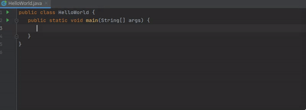

<text-box variant='learningObjectives' name='Learning Objectives'>

- Learn to write a program that prints text.

- Know what an "argument" is.

</text-box>

In the previous lesson, we learned that using the command
```java
System.out.println("Hello World!")
```
results in the following output to be printed in the console:

<sample-output>

Hello World!

</sample-output>

The same command can be used to print other text as well. For example, we might want to say goodbye as well. We would then again use the `System.out.println` command, now putting a different value between the brackets. For example, we could use the command as follows:
``` Java
System.our.println("Goodbye!")
```
This then leads to the below output being printed to the console.

<sample-output>

Goodbye!

</sample-output>

The input that we give between brackets is referred to as an `argument` of the function. In the first case, we gave as argument to the function `System.out.println` the text ``"Hello World!"``, while in the second case our argument was ``"Goodbye!"``. Note that we can use any argument to this function, as long as it is composed of text, as indicated by the quotation marks `""` around the text that we want to print.

<programming-exercise name="Goodbye">

The template for this assignment already contains the boilerplate that is needed for the assignment:
```java
public class Goodbye {
    public static void main(String[] args) {
        // Code comes here
    }
}

```

Complete the assignment by replacing the comment `// Code comes here` by the necessary code. Your program should print the text below when it is run:

<sample-output>

Goodbye! I hope to see you again.

</sample-output>

You can check your code by clicking on the `Check` button that is shown in the bottom right of the screen.

</programming-exercise>


## Printing Multiple Lines
Programs are constructed command-by-command, where each command is placed on a new line. In the example below, the command `System.out.println` appears twice, which means that two print commands are being executed in the program.

```java
public class Example {
    public static void main(String[] args) {
        System.out.println("Hello world!");
        System.out.println("... and the universe!");
    }
}
```

The program above will print:

<sample-output>

Hello world!
... and the universe!

</sample-output>


<text-box variant=hint name="Assignment guidelines">

  The guidelines in the assignments regarding the print format are very precise. If the assignment expects you to print a parenthesis, you must print the parenthesis.
  This preciseness with regard to the output is relevant in programming in general. Missing a single character may cause an error. Novice programmers often enter a comma instead of a dot, and write, for instance `printin` instead of `println`, leave out apostrophes, or forget the semicolon after a command. Any one of these would cause an error and cause the program execution to fail.
  Learning programming is, in fact, a path full of mistakes -- and every error message is a chance to learn. Keep a look out for any red signs and try to read the test errors!
  
</text-box>

<programming-exercise name="Multiple Lines">

The template for this assignment already contains the boilerplate that is needed for the assignment:
```java
public class MultipleLines {
    public static void main(String[] args) {
        // Code comes here
    }
}

```

Complete the assignment in such a way that your code prints the following output when run.

<sample-output>

Hello, this is your program!
My presence is only short-lived.
So I will now say Goodbye!

</sample-output>

</programming-exercise>

<text-box variant=hint name="Using a shortcut for printing">

Writing the command `System.out.println("...")` can be taxing. Try to write **sout** in IntelliJ on a blank line (within main) and press tab. Note how this will autocomplete to `System.out.println("...")`. This shortcut may save you a lot of time in the future.



</text-box>

## Code style and Code Comments

### Semicolon Separates Commands
Commands are separated with a semicolon `;`. We could, if we wanted to, write almost everything on a single line. However, that would be difficult to understand.

```java
System.out.println("Hello "); System.out.println("world"); System.out.println("!\n");
```

<sample-output>

Hello
world
!

</sample-output>

Although the previous example works, it's important to be considerate of other programmers (and your future self!) and to use line breaks. That way, anyone reading the program knows that each line does only a single concrete thing.

### Comments
Source code can be commented to clarify it or to add notes. There are two ways to do this.

- Single-line comments are marked with two slashes `//`. Everything following them on the same line is interpreted as a comment.

- Multi-line comments are marked with a slash and an asterisk `/*`, and closed with an asterisk followed by a slash `*/`. Everything between them is interpreted as a comment.

Below is an example of a program where both are used.

```java
public class Comments {
    public static void main(String[] args) {
        // Printing
        System.out.println("Text to print");
        System.out.println("More text to print!");
        /* Next:
        - more on printing
        - more practice
        - variables
        - ...
        */
        System.out.println("Some other text to print");
        // System.out.println("Trying stuff out")
    }
}
```

The last line of the example shows a particularly handy use-case for comments. Code that has been written does not need to be deleted to try out something else. However, do make sure that your code stays organized and prevent having old code in comments in the final version of your program.
